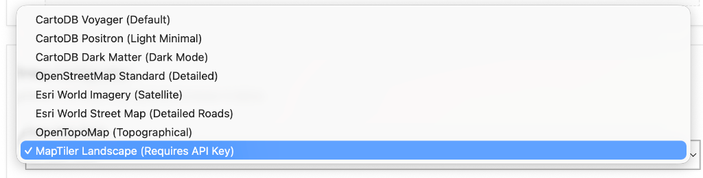
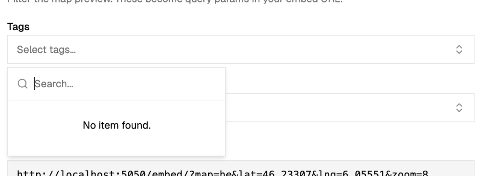

# FCC Maps

Create interactive, embeddable maps directly from your WordPress posts—without installing heavy WordPress plugins.

If you have a WordPress website with articles or posts containing location info (like latitude, longitude, tags, or categories), FCC Maps automatically grabs that information and displays it on a clean, custom map that you can drop into any website.

## Screenshots

### Admin Portal (Map Editor)


### Frontend (Map Widget Embed)


---

## How it helps you

Instead of manually maintaining maps or paying monthly fees for premium mapping tools, FCC Maps lets you:

* **Use your existing content:** Every time you publish a post on WordPress with coordinates, it automatically shows up on your map.
* **Keep your website fast:** The maps are super lightweight and run independently, so they won't slow down your WordPress site.
* **Make custom views:** You can filter markers to show different maps (e.g., only "Featured Locations" or locations in "Europe") using the same WordPress list.
* **Put it anywhere:** You get a simple code snippet to copy/paste your map into any page, builder, or site.

---

## Understanding the Admin Dashboard

The admin panel is designed to be simple and straightforward:

* **Maps** — See all your created maps, add new ones, and adjust settings like default starting view, zoom levels, and filtering rules.
* **Pointer Colors** — Choose custom pin colors for different categories or tags so your map is easy to read.
* **Branding** — Upload your logo, add a collapsed version for the sidebar, and set a custom browser favicon/title.
* **Metrics & Sync** — Check when the last automated sync ran, how many locations were found, or review activity logs if something isn't showing up correctly.
* **Settings** — Put in your WordPress site address, configure how often it updates, and choose your favorite background map design (like satellite view, clean light grey, or dark mode).

---

## How to embed a map

Once you configure a map, the dashboard gives you a simple embed code to paste onto your website:

```html
<iframe
  src="https://your-server.com/embed/?map=default"
  width="100%"
  height="500"
  frameborder="0"
  allowfullscreen>
</iframe>
```

### Changing the look on the fly (Options)

You can add options directly to the web link (`src` inside the code above) to change what the visitor sees:

| Option | What it does | Example |
|---|---|---|
| `map` | Selects which map instance to show | `map=my-custom-map` |
| `lat` & `lng` | Focuses the map on specific coordinates | `lat=45&lng=6` |
| `zoom` | How close up the view starts (1 is far out, 20 is street level) | `zoom=3` |
| `categories` | Limits the map to specific categories | `categories=Events,Labs` |
| `tags` | Limits the map to specific tags | `tags=featured` |
| `clustering` | Group nearby markers into circles when zoomed out (`1` = On, `0` = Off) | `clustering=1` |

---

## Keeping your maps up to date

Your map will look for new WordPress posts on a schedule you configure (for example, every 12 hours).

If you just added a new post and want it to show up right away:
1. Open **Metrics** in the dashboard.
2. Click **Force Sync**.

*Note for website administrators:* You can also set up an external automated task using the **External Trigger URL** listed in your Settings page to trigger a sync automatically whenever a new post is published.

---

## Setting up and Running

### Basic installation
1. Install dependencies:
   ```bash
   npm run install:all
   ```
2. Start the application:
   ```bash
   npm run dev
   ```
3. Open `http://localhost:5174/admin/` in your browser to start configuring your map.

### Deploying to production
To run this application permanently on a server:
```bash
npm run build
npm run start
```

---

## Technical Details (For Developers)

* **Backend:** Node.js + Express (TypeScript), running on port `5050`
* **Frontend:** React + Vite, styled using Tailwind CSS and shadcn/ui
* **Map Renderer:** Leaflet.js
* **Database:** Local JSON files (no database server like MySQL or PostgreSQL required)
