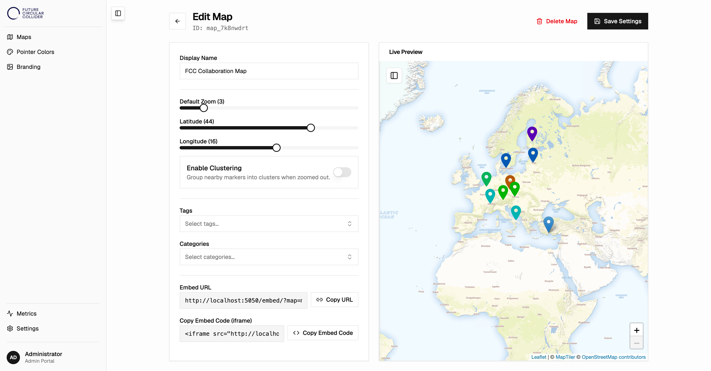
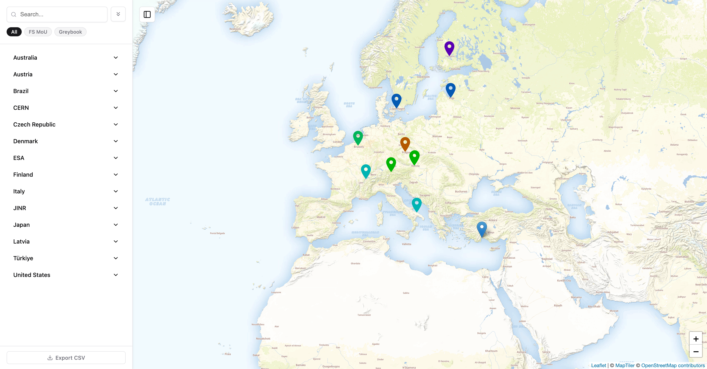

# FCC Maps 

FCC Maps is an interactive, embeddable map generator designed specifically for the Future Circular Collider (FCC) project at CERN. 

Due to the security constraints and limitations of CERN's stripped-down version of WordPress (which prevents the installation of arbitrary third-party mapping plugins), this application acts as an independent tool. It reads your WordPress articles via the standard REST API, parses geographical information, and builds customizable map widgets that you can easily embed back into CERN websites or portals.

## Screenshots

### Admin Portal (Map Editor)


### Frontend (Map Widget Embed)


---

## How it helps you

Instead of manually maintaining map assets or struggling with CMS restrictions, FCC Maps lets you:

* **Use your existing content:** Every time you publish a post on WordPress with coordinates, it automatically shows up on your map.
* **Work around CERN CMS restrictions:** Since it reads content via the standard API, you do not need to install any custom plugins inside WordPress.
* **Make custom views:** You can filter markers to show different maps (e.g., only "Featured Locations" or locations in "Europe") using the same WordPress list.
* **Put it anywhere:** You get a simple code snippet to copy/paste your map into any page, builder, or site.

---

## Setting up your WordPress posts & Connection

To make sure FCC Maps can find and pin your locations, format your WordPress posts and configure your credentials like this:

### 1. Add Coordinates to the Post Excerpt
Place the latitude and longitude inside the **Excerpt** box of your WordPress post, separated by a comma.
* **Format:** `latitude, longitude`
* **Example:** `45.1234, 6.5678`
* *Tip:* FCC Maps reads the first pair of decimal numbers it finds in the Excerpt.

### 2. (Optional) Custom website link
By default, clicking a marker links back to the original WordPress post. If you want a marker to link to a different custom website instead:
* In your post editor, switch to HTML view and add a link or text wrapped in an element with `id="website-url"`.
* **Example:** `<a id="website-url" href="https://custom-target.com">Visit Website</a>` or `<div id="website-url">https://custom-target.com</div>`

### 3. Categories, Tags & Photos
* **Pins colors & filtering:** Map filters and pin colors are based on the standard **Categories** and **Tags** you assign to your posts.
* **Photos:** If you set a **Featured Image** on your post, it will display as a thumbnail inside the map popup.

### 4. How to generate WordPress API Credentials
If your WordPress REST API is restricted or private, you need to provide credentials:
1. Log into your WordPress admin dashboard.
2. Go to **Users** > **Profile** (or **All Users** and edit your user account).
3. Scroll down to the **Application Passwords** section.
4. Enter a name for the credentials (e.g., `FCC Maps`) and click **Add New Application Password**.
5. Copy the generated password (a 24-character code). *This is only shown once.*
6. In the FCC Maps Admin panel under **Settings**, turn on **Require Authentication**, then input your standard WordPress username and this generated Application Password.

---

## Understanding the Admin Dashboard

The admin panel is designed to be simple and straightforward:

* **Maps** : See all your created maps, add new ones, and adjust settings like default starting view, zoom levels, and filtering rules.
* **Pointer Colors** : Choose custom pin colors for different categories or tags so your map is easy to read.
* **Branding** : Upload your logo, add a collapsed version for the sidebar, and set a custom browser favicon/title.
* **Metrics & Sync** : Check when the last automated sync ran, how many locations were found, or review activity logs if something isn't showing up correctly.
* **Settings** : Put in your WordPress site address, configure how often it updates, and choose your favorite background map design (like satellite view, clean light grey, or dark mode).

---

## How to embed a map

Once you configure a map, the dashboard gives you a simple embed code to paste onto your website:

```html
<iframe
  src="https://your-server.com/embed/?map=default"
  width="100%"
  height="500"
  frameborder="0"
  allowfullscreen>
</iframe>
```

### Changing the look on the fly (Options)

You can add options directly to the web link (`src` inside the code above) to change what the visitor sees:

| Option | What it does | Example |
|---|---|---|
| `map` | Selects which map instance to show | `map=my-custom-map` |
| `lat` & `lng` | Focuses the map on specific coordinates | `lat=45&lng=6` |
| `zoom` | How close up the view starts (1 is far out, 20 is street level) | `zoom=3` |
| `categories` | Limits the map to specific categories | `categories=Events,Labs` |
| `tags` | Limits the map to specific tags | `tags=featured` |
| `clustering` | Group nearby markers into circles when zoomed out (`1` = On, `0` = Off) | `clustering=1` |

---

## Keeping your maps up to date

Your map will look for new WordPress posts on a schedule you configure (for example, every 12 hours).

If you just added a new post and want it to show up right away:
1. Open **Metrics** in the dashboard.
2. Click **Force Sync**.

*Note for website administrators:* You can also set up an external automated task using the **External Trigger URL** listed in your Settings page to trigger a sync automatically whenever a new post is published.

---

## Setting up and Running

### Basic installation
1. Install dependencies:
   ```bash
   npm run install:all
   ```
2. Start the application:
   ```bash
   npm run dev
   ```
3. Open `http://localhost:5174/admin/` in your browser to start configuring your map.

### Local CERN SSO test
1. Copy `server/.env.example` to `server/.env` and fill in your CERN values.
2. Make sure CERN has whitelisted this redirect URI for the app: `http://localhost:5050/auth/callback`.
3. Set `OIDC_REQUIRED_GROUPS` in `server/.env`. You can use one group or a comma-separated list if the CERN e-group name changes later.
4. Start the backend and frontend:
   ```bash
   npm run dev
   ```
5. Open `http://localhost:5050/admin/`.
6. If the CERN group check is configured correctly, unauthenticated access should redirect to CERN SSO, users outside the group should see `403 Access Denied`, and users inside the group should land on the admin dashboard.
7. The public map/embed endpoints should still work without login, including `/embed` and the sync endpoint `/api/maps/default/sync`.

### Deploying to production
To run this application permanently on a server:
```bash
npm run build
npm run start
```

---

## Technical Details (For Developers)

* **Backend:** Node.js + Express (TypeScript), running on port `5050`
* **Frontend:** React + Vite, styled using Tailwind CSS and shadcn/ui
* **Map Renderer:** Leaflet.js
* **Database:** Local JSON files (no database server like MySQL or PostgreSQL required)
