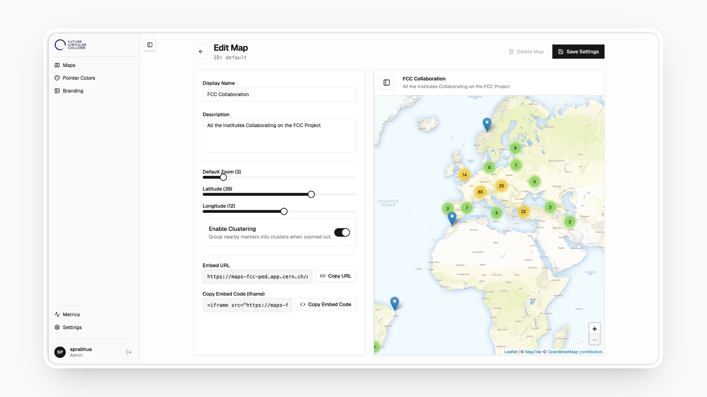
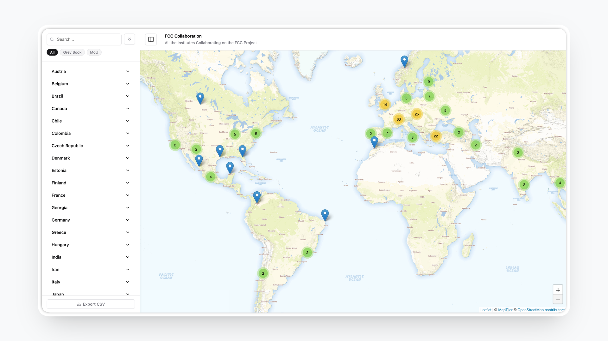

# FCC Maps

FCC Maps is an interactive, embeddable map generator designed specifically for the Future Circular Collider (FCC) project at CERN. 

The idea is to provide a single source of truth for all locations and attributes related to the FCC project.

Due to the security constraints and limitations of CERN's stripped-down version of WordPress (which prevents the installation of arbitrary third-party mapping plugins), this application acts as an independent tool. It reads your WordPress posts via the standard REST API, parses geographical information, and builds customizable map widgets that you can easily embed back into CERN websites or elsewhere.

## Screenshots

### Admin Portal (Map Editor)


### Frontend (Map Widget Embed)


---

## Features

- **Automatic Updates**: When you publish a WordPress post with coordinates in the excerpt, it automatically gets updated on the map.
- **Bypass CMS Restrictions**: You do not need to install plugins inside CERN WordPress.
- **Custom Map Views**: Use categories or tags to filter locations.
- **Embed Anywhere**: Copy and paste the HTML iframe code into your website page.
- **Login**: Straightforward log in with CERN SSO.
- **Public CSV Export**: Anyone can download the map location list as a CSV file.

---

## WordPress Post Configuration

To show your locations on the map, configure your WordPress posts as follows:

### 1. Add Coordinates in the Excerpt
Write the latitude and longitude in the WordPress excerpt box. Separate the values with a comma.
- **Format**: `latitude, longitude`
- **Example**: `46.2330, 6.0555`
- *Note*: The tool reads the first two numbers in the excerpt.

### 2. Custom Website Link
By default, clicking a marker links to the WordPress post. To link to a different website:
- Open the WordPress HTML editor. Add an element with `id="website-url"`.
- **Example**: `<a id="website-url" href="https://cern.ch">Visit Website</a>`

### 3. Categories, Tags, and Images
- **Colors and Filters**: Categories and tags change pin colors and map filters.
- **Images**: The featured image shows as a thumbnail in the marker popup.

### 4. Get WordPress API Credentials
If your WordPress API is private, do these steps:
1. Log in to the WordPress dashboard.
2. Go to **Users** > **Profile**.
3. Scroll to **Application Passwords**.
4. Enter a name (example: `FCC Maps`). Click **Add New Application Password**.
5. Copy the 24-character password. The system shows this code only one time.
6. Open the FCC Maps dashboard **Settings**. Enable **Require Authentication**. Enter your username and this application password.

---

## Configuration (Environment Variables)

Configure these variables in the `server/.env` file:

| Variable | Description | Default |
|---|---|---|
| `PORT` | The port number for the server | `5050` |
| `NODE_ENV` | Environment mode (`development` or `production`) | `development` |
| `SESSION_SECRET` | Secret key to secure session cookies | (Random) |
| `TRUST_PROXY` | Set proxy trust (use `true` or `1` behind reverse proxy) | `0` |
| `CERN_SSO_ENABLED` | Enable CERN SSO login authentication (`true` or `false`) | `false` |
| `OIDC_ISSUER_URL` | Issuer URL of CERN OIDC provider | `https://auth.cern.ch/...` |
| `OIDC_CLIENT_ID` | Application client ID registered with CERN | - |
| `OIDC_CLIENT_SECRET` | Application client secret from CERN | - |
| `OIDC_REDIRECT_URI` | Callback URL for login redirect | - |
| `OIDC_REQUIRED_GROUP` | Comma-separated CERN e-groups allowed to log in | - |

---

## How to Embed a Map

Configure a map. The dashboard shows an embed code. Paste this code into your website:

```html
<iframe
  src="https://your-server.com/embed/?map=default"
  width="100%"
  height="500"
  frameborder="0"
  allowfullscreen>
</iframe>
```

### URL Parameters
You can add parameters to the `src` URL to change the view:

| Parameter | Description | Example |
|---|---|---|
| `map` | The ID of the map to show | `map=europe-map` |
| `lat` & `lng` | Map center coordinates | `lat=46.2&lng=6.0` |
| `zoom` | Zoom level (value `1` to `20`) | `zoom=12` |
| `categories` | Filter map to these categories (comma-separated) | `categories=Labs,Offices` |
| `tags` | Filter map to these tags (comma-separated) | `tags=featured` |
| `clustering` | Group near markers (`1` = On, `0` = Off) | `clustering=1` |

---

## Setup and Run

### Install
Install all project dependencies:
```bash
npm run install:all
```

### Run Locally (Development)
Start the backend and frontend dev servers:
```bash
npm run dev
```
Open `http://localhost:5050/admin/` in your browser.

### Build and Run (Production)
Build the application:
```bash
npm run build
```
Start the production server:
```bash
npm run start
```

---

## Technical Details

- **Backend**: Node.js + Express (TypeScript)
- **Frontend**: React + Vite, Tailwind CSS, shadcn/ui
- **Map Library**: Leaflet.js
- **Data Storage**: Local JSON files (no database server required)
